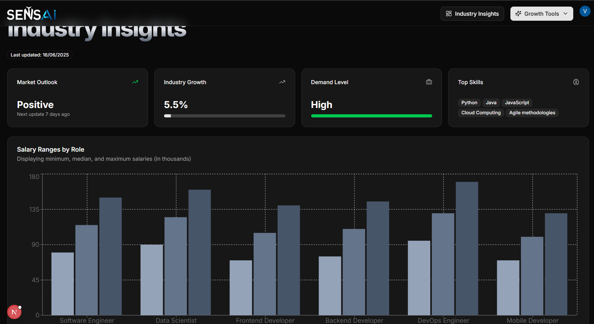
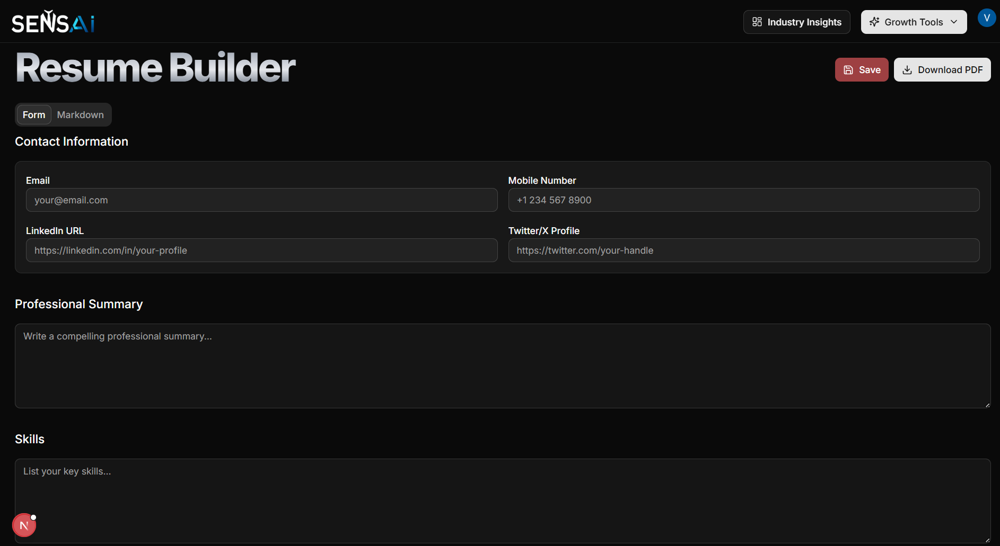
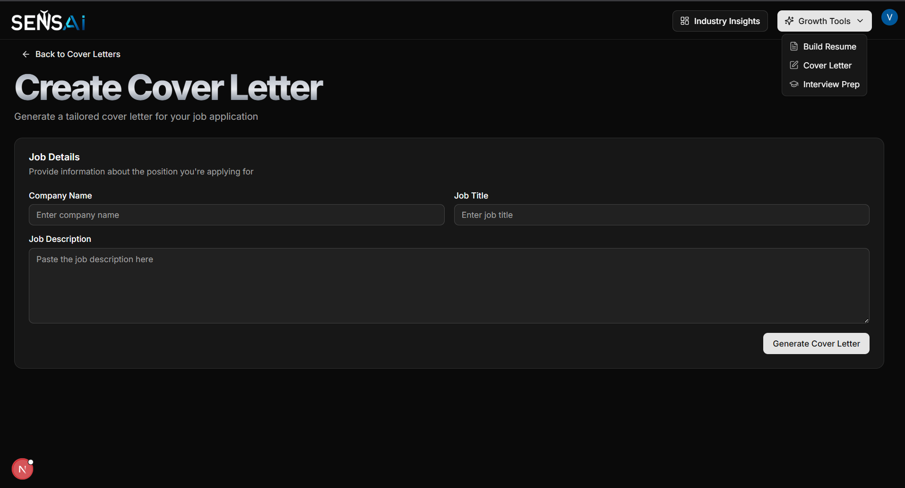

# 🚀 SensAi

**SensAi** is an AI-powered platform designed to help users accelerate their job search with intelligent tools. From crafting tailored resumes and cover letters to preparing for interviews and receiving weekly industry insights, SensAi brings together the power of AI and modern web technologies.

---

## 🧠 Features

- 📝 **AI Resume Builder**  
  Generate professional, role-specific resumes with smart AI suggestions.

- ✉️ **AI Cover Letter Generator**  
  Instantly create personalized, impactful cover letters.

- 🎯 **AI Interview Preparation**  
  Access AI-curated questions and advice tailored to your target industry or role.

- 📊 **Weekly Industry Insights**  
  Receive weekly updates about the industry you selected at registration — trends, news, and analytics.

- 🔐 **Authentication & User Management with Clerk**  
  Secure sign-up, sign-in, and user session handling with Clerk integration.

- ⚡ **Event-Driven Workflows with Inngest**  
  Scheduled tasks like sending weekly insights are powered by Inngest’s event-driven architecture.

- 🗄️ **Cloud Database with Neon**  
  Scalable, serverless PostgreSQL used for storing user data, content, and insights.

- 🎨 **Beautiful UI with shadcn/ui**  
  Built with accessible, customizable components powered by Tailwind CSS and shadcn/ui.

---

## ⚙️ Tech Stack

| Layer           | Tech / Service                   |
|----------------|----------------------------------|
| Frontend       | **Next.js**, **React**, **Tailwind CSS**, **shadcn/ui** |
| Backend        | **Node.js**, **Inngest**, **Clerk** |
| Authentication | **Clerk.dev**                    |
| Database       | **Neon (PostgreSQL)**            |
| AI Integration | **OpenAI API / LangChain (if used)** |
| Deployment     | **Vercel**                       |
| CI/CD & Hosting| GitHub + Vercel                  |

---

## 📦 Installation & Setup

```bash
# Clone the repository
git clone https://github.com/vedanitesh/SensAi.git
cd SensAi

# Install dependencies
npm install

# Set up environment variables (e.g., .env.local)
cp .env.example .env.local
# Add your Clerk, Inngest, Neon, OpenAI keys

# Run the development server
npm run dev
```


## 📸 Screenshots

### 📝 Resume Builder


### 📈 Weekly Industry Insights


### ✉️ AI Cover Letter Generator



## 🙋‍♀️ Author
Made with ❤️ by Veda Bhadane
Feel free to explore, contribute, and connect!

##📄 License
Licensed under the MIT License.


